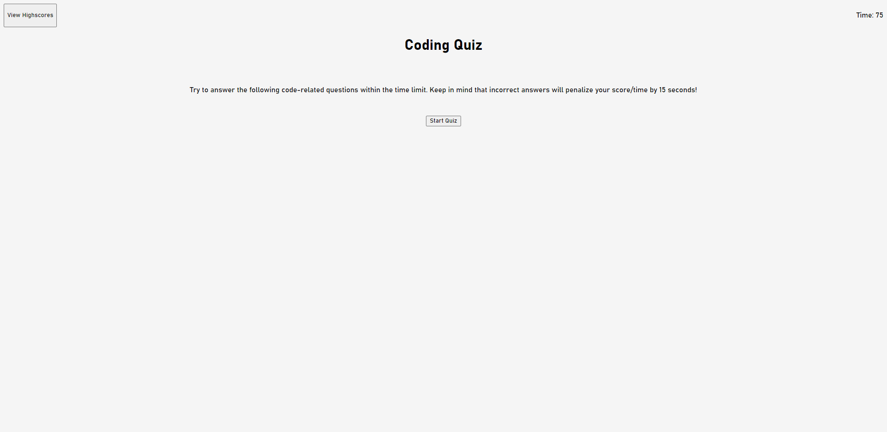
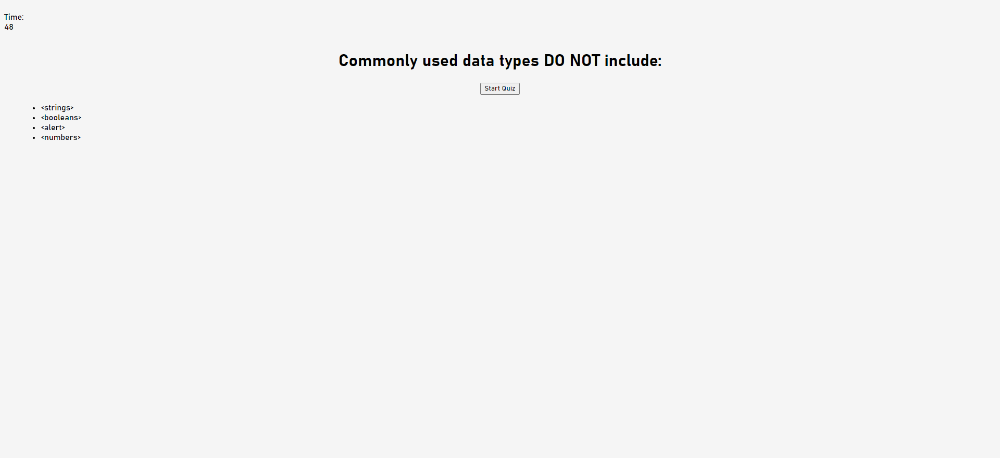

# coding-quiz

Create coding quiz using javascript, html and css.

## User Story

```
AS A coding boot camp student
I WANT to take a timed quiz on JavaScript fundamentals that stores high scores
SO THAT I can gauge my progress compared to my peers
```

## Acceptance Criteria

```
GIVEN I am taking a code quiz
WHEN I click the start button
THEN a timer starts and I am presented with a question
WHEN I answer a question
THEN I am presented with another question
WHEN I answer a question incorrectly
THEN time is subtracted from the clock
WHEN all questions are answered or the timer reaches 0
THEN the game is over
WHEN the game is over
THEN I can save my initials and my score
```

## Getting Started
- Created repository and cloned to work on local device
- Created Html/Css and javascript files

## HTML
- Created Html with appropriate syntaxs
- Header created to contain highscores button and timer for the quiz
- Main content created containing h1 that would turn into questions a ul that would contain answers when the quiz is started.
- Start button created in main
- Div created that would not be visible, and would then be made visible at the end of the quiz, showing score and a textbox to put your initials
- Div highscoreTally created that shows the list of highscores in ol which would be created via js. This is hidden and would be displayed by clicking view highscore via js

## CSS
- Created basic styling, font, margin
- flex properties, formating

## Javascript
- Listed and defined syntaxs from html that would be used
- Created a quiz card that would contain the questions and the answers
- Created a mainpage function that for when user is redirected back to the start of the page
- Function created to start the quiz, change in UI, intiates questions and timer
- Function created to start the timer countdown
- Function created to set questions onto the page
- Function created to create the answer buttons as li
- Function created to cycle through the array of questions
- Function created for the end of the quiz, displaying the score and allowing the user to input initials
- Function created to check if the selected answer is wrong or not, penalising the time by 5 seconds
- Function created to store data of the user (score and initials) onto local storage
- Function created to show highscore tally and pull data from local storage and order scores in list
- Function created to clear local storage
- Function init created to initialize event listeners upon loading the page

## Tested
- Format and display (showing the right things at the right stages)
- Timer runs properly, score properly deducted when answer wrong
- Questions and answers displayed properly

## Bugs/Extra
~~ - Doesnt display local data initals onto highscore after submiting intials (need fix) ~~
- FIXED - typo on script.js:225:28 caused local data to not show up
- Clean up Css for questions/answers and hover affect when hovering over answers. styling elements

## Final Product





- http://jpjp2328.github.io/coding-quiz
